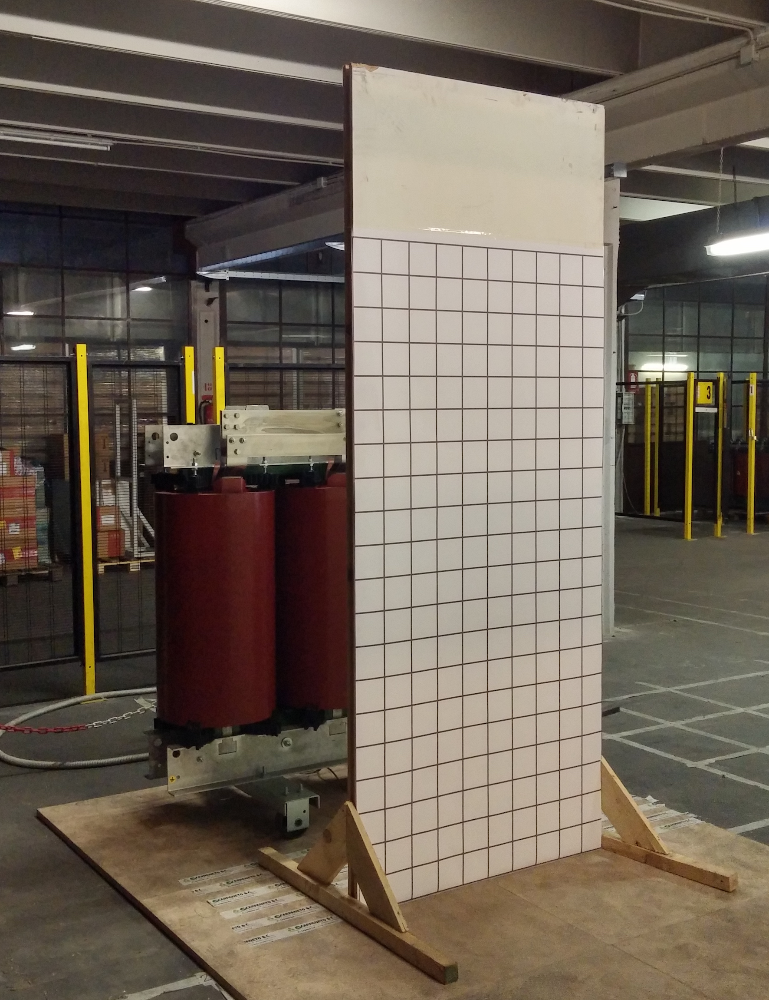
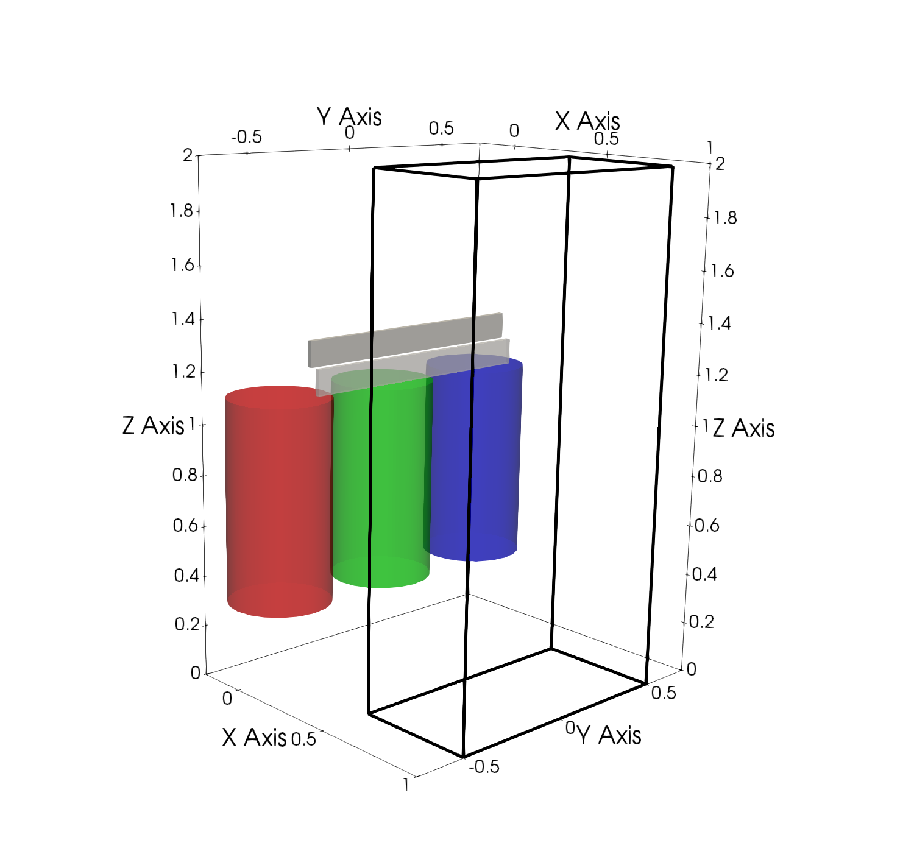
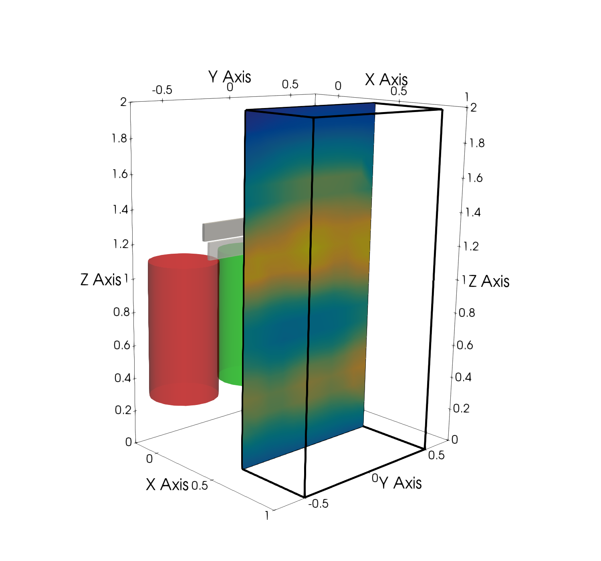
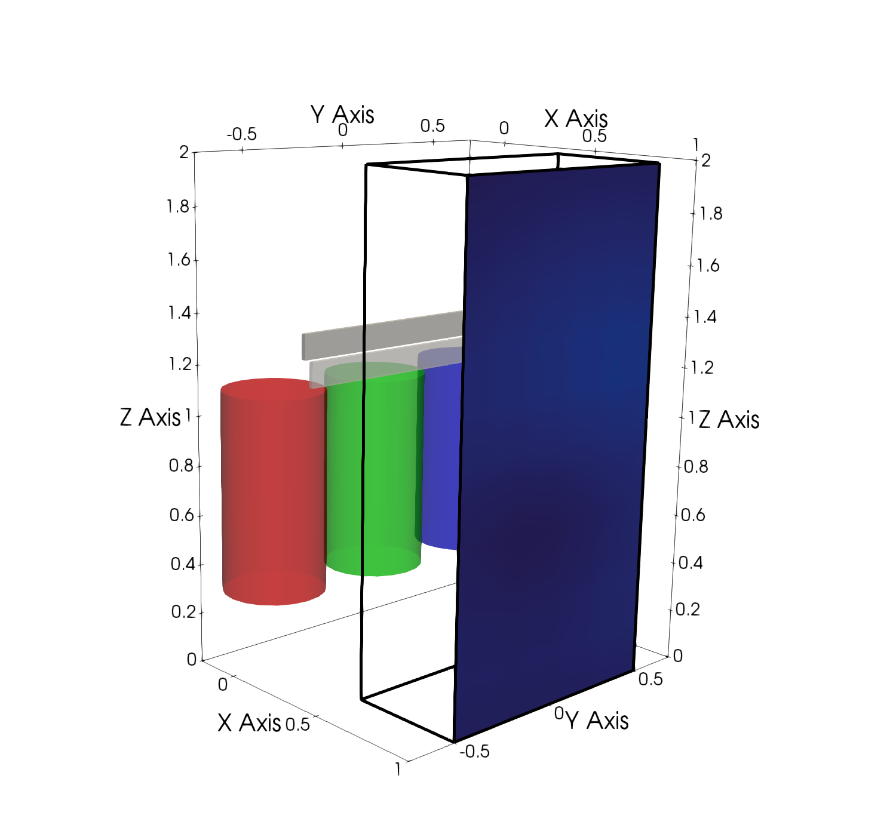
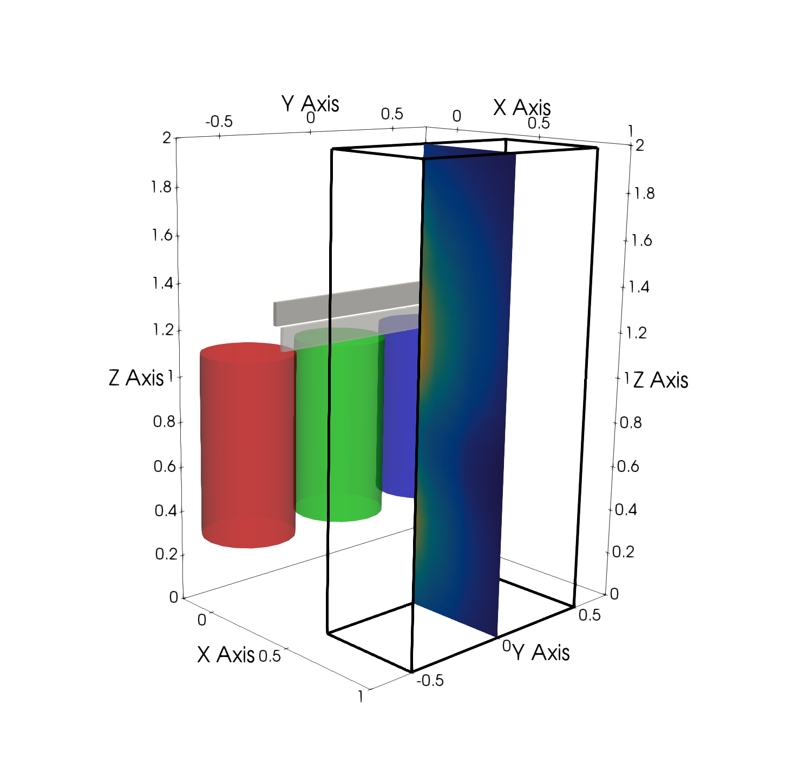

# field_measurements

## Introduction

This repository includes the magnetic flux density measured in front of a power transformer at 1386 regularly spaced points.

These data have been registered for research purposes. If you use them for your research, you can consider citing the following reference where the measurement procedure and the data are fully described:

* **Freschi F., Giaccone L., Cirimele V., Canova A., *"Numerical assessment of low-frequency dosimetry from sampled magnetic fields"*, Physics in Medicine & Biology, Vol 63 (2018) 015029, doi:10.1088/1361-6560/aa9915**

The paper is available on-line here [link](http://iopscience.iop.org/article/10.1088/1361-6560/aa9915). 

## Repository content

* `data_set.txt` : text file including the measurements. The file include a legend to understand the data meaning
* `plot_data.m`: for convenience of the MATLAB&reg; users, this script reads and visualises the data

If any issues arise using the data, feel free to contact me ([luca.giaccone@polito.it](mailto:luca.giaccone@polito.it)) or any other authors of the paper.

## Remarks on the data

As already mentioned the repository provides 1386 regularly spaced points. This result is obtained by means of a preliminary interpolation of the raw data.

&nbsp;&nbsp;&nbsp;

<b>Fig. 1</b> measurements setup (left) and 3d representation of the inspection volume (right)

Measurements were performed using the setup represented in Fig. 1. According to this scheme, the wooden structure is used to register the magnetic field on planes with *x = constant*. Raw data are registered on the following planes:

1. *x* = 0.5 m ==> grid size 10 cm
2. *x* = 0.6 m ==> grid size 10 cm
3. *x* = 0.8 m ==> grid size 10 cm
4. *x* = 1 m ==> grid size 20 cm

The grid size were decided at measuring time looking at the gradient of the field. The grid size can be increased as the gradient decreases without affecting the measurement accuracy. For this reason, as shown in the following figure, in the farthest inspection plane from the transformer (x = 1 m) the grid size has been doubled.

The same concept applies for the selection of the planes at x=0.5m, x=0.6m, x=0.8m and x=1m.

&nbsp;&nbsp;&nbsp;

&nbsp;&nbsp;&nbsp;

<b>Fig. 2</b> B-field on the plane x=0.5m (left). B-field on the plane x=1m (center). B-field on the plane y=0m (right).

The raw data are finally interpolated on a regularly spaced grid (grid size 10 cm) of 1386 points and provided in this repository.

*Latest updated: 10-11-2017*
